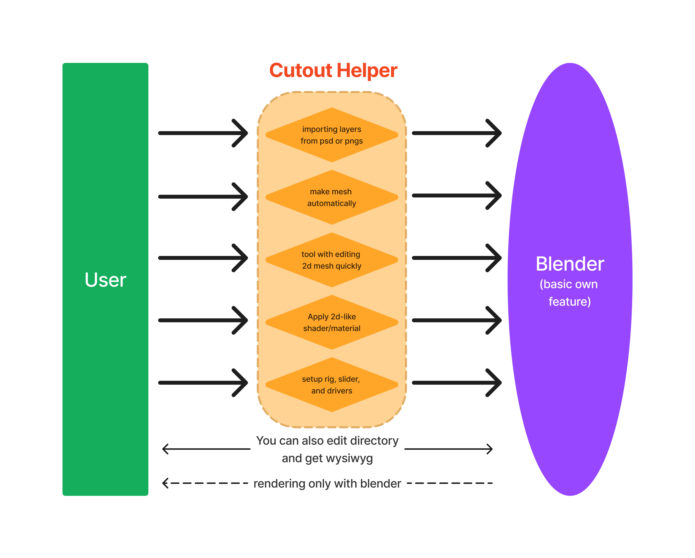

# cutout-producer

Blender addon to help create 2d cutout animations

## concept

Cutout Producer is an add-on that plays an auxiliary role in achieving 2D cutout animation in Blender.

Blender can be manipulated through its own python modules to control the UI, operations, and other Blender functions. However, for users, it is quite inconvenient in all aspects to have add-ons edit their projects without their permission, or to have projects that cannot be executed or reproduced without add-ons.

Cutout Producer achieves the requested operations for the user, but it does so entirely with Blender's standard features. (I call this "safety operation").

For example, compositing modes such as 2D layer multiplication and addition are represented as such by shaders and materials. In addition, this allows you to see the result more concisely and quickly than dealing with a lot of annoying nodes, etc. in the render node.

This project is still under development and the development rate is very slow, but we are working on it.
PRs and issues are welcome!
